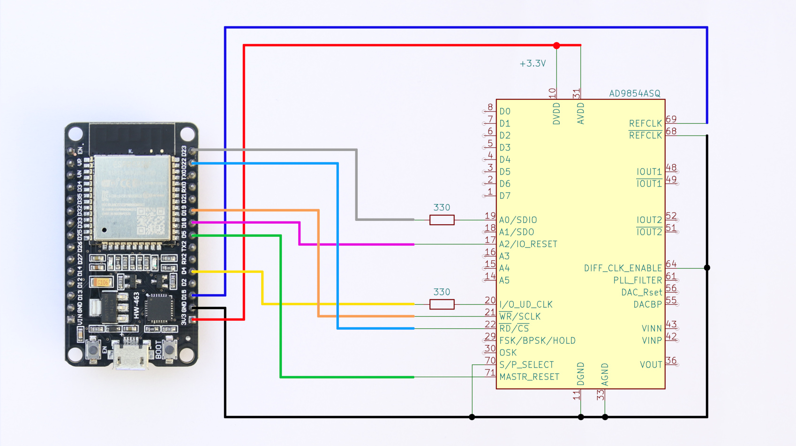

### Test circuit for use with the examples.

The circuit uses ESP32-WROOM-32D on NodeMCU-ESP32 and AD9854 with 5MHz clock produced by ESP.
The examples should work with other ESPs as well, but this may require changes to the SPI bus configuration (ad9854_spi.h).
Don't forget to copy the current AD9854 library to the example folder.

